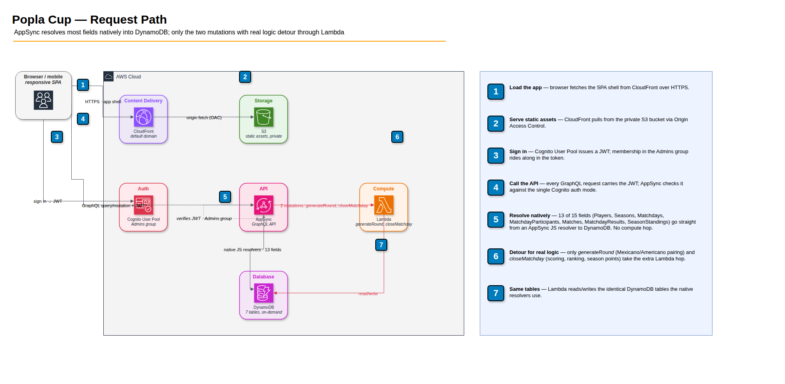
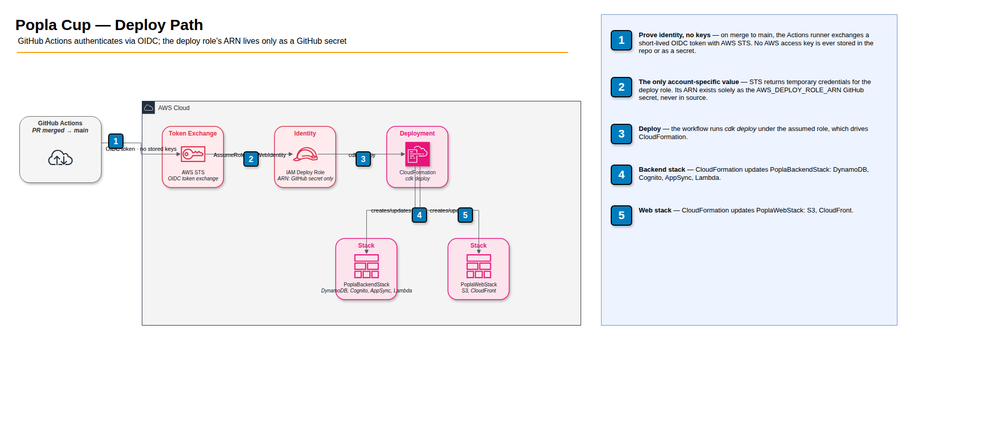

# Popla Cup — Architecture

Companion to `SPEC.md`. Describes the target AWS serverless architecture and
the CDK/CI setup that deploys it.

## Diagrams

AWS architecture diagrams, drawn with official AWS4 icons, live in
[`docs/`](docs/) as draw.io files — open them in
[diagrams.net](https://app.diagrams.net), the draw.io desktop app, or the
VS Code draw.io extension:

- [`docs/popla-request-path.drawio`](docs/popla-request-path.drawio) —
  browser → CloudFront/S3 and browser → AppSync, with the native-vs-Lambda
  resolver split front and center: reads and most writes resolve
  **natively** (an AppSync JS resolver straight to DynamoDB, no compute in
  between); only `generateRound` (Mexicano/Americano pairing) and
  `closeMatchday` (scoring, ranking, season-points transaction) — the two
  mutations with real algorithmic content — detour through Lambda before
  reaching the same tables. Rendered:
  
- [`docs/popla-deploy-path.drawio`](docs/popla-deploy-path.drawio) — how a
  merged PR reaches AWS: GitHub Actions exchanges a short-lived OIDC token
  with AWS STS to assume an IAM deploy role (no stored AWS keys), then
  runs `cdk deploy` against CloudFormation to update `PoplaBackendStack`
  and `PoplaWebStack`. The one account-specific value in that whole flow —
  the deploy role's ARN — exists solely as the `AWS_DEPLOY_ROLE_ARN`
  GitHub secret, which is why it never surfaces in source or in this
  repo's Actions logs, even though `cdk deploy` itself prints ARNs that
  contain it. Rendered:
  

Rendered PNGs are checked in so the diagrams show up inline on GitHub
(which doesn't render `.drawio` XML); regenerate them from the source
files whenever the diagrams change, since nothing enforces they stay in
sync automatically.

## Stack Overview

- **Frontend:** React + Vite + TypeScript (`web/`). A plain `fetch`-based
  GraphQL client rather than Apollo/Amplify — the API surface is small
  enough that a full client library isn't worth the dependency weight.
  Cognito auth via `amazon-cognito-identity-js` (SRP, matching the User
  Pool client's `authFlows: { userSrp: true }`), including the
  `newPasswordRequired` challenge admins hit on first sign-in after
  `admin-create-user`.
- **Frontend hosting:** S3 (private, Origin Access Control) + CloudFront.
- **API:** AWS AppSync (GraphQL), Cognito User Pool authorizer.
- **Business logic:** AppSync JS (native) resolvers to DynamoDB for CRUD/
  reads and simple writes; Lambda resolvers for the two operations with
  real algorithmic logic (round generation, matchday close).
- **Data:** DynamoDB, one table per entity (not single-table design — this
  app's scale and access patterns don't warrant the added complexity).
- **Auth:** Cognito User Pool, `Admins` group, phase-2 federated social
  login (Google etc.) on the same pool.
- **IaC:** AWS CDK (TypeScript), two stacks (`PoplaBackendStack`,
  `PoplaWebStack`).
- **CI/CD:** GitHub Actions, deploying via `cdk deploy`, authenticated to
  AWS via GitHub OIDC (no long-lived access keys).
- **Domain:** default CloudFront/AppSync endpoints for now; Route53 + ACM
  custom domain to be added later, in front of both the web distribution
  and the API.

## Data Model (DynamoDB)

Plain multi-table design. Each table below is a physical DynamoDB table.

### `Players`
- PK: `playerId`
- Attributes: `displayName`, `phone` (optional, E.164), `email`
  (optional), `cognitoSub` (nullable — set when an admin registers/
  changes the player's `phone`, via `AdminCreateUser`, not on first
  login; see Auth below), `createdAt`.
- Persists across seasons — this is the durable identity a matchday
  participant and season standings entry both point back to.

### `Seasons`
- PK: `seasonId`
- Attributes: `name`, `status` (`ACTIVE` | `CLOSED`), `startDate`,
  `closedAt`.

### `Matchdays`
- PK: `matchdayId`
- Attributes: `seasonId`, `date`, `startTime` (optional time-of-day —
  kept as a separate attribute rather than folding into `date` so
  existing rows don't need migrating), `format` (`MEXICANO` |
  `AMERICANO`), `status` (`SETUP` | `IN_PROGRESS` | `CLOSED`).
- GSI `bySeasonId`: PK `seasonId`, SK `date` — list matchdays in a season,
  chronologically.

### `MatchdayParticipants`
- PK: `matchdayId`, SK: `playerId`
- The registered participant list for a matchday. Count must be a
  multiple of 4.

### `Matches`
- PK: `matchdayId`, SK: `ROUND#<n>#COURT#<c>`
- Attributes: `round`, `court`, `team1PlayerIds` (2), `team2PlayerIds`
  (2), `team1Games`, `team2Games`, `status` (`PENDING` | `COMPLETE`).
- One item per set (N/4 courts per round, one or more rounds per
  matchday — see SPEC.md).

### `MatchdayResults`
- PK: `matchdayId`, SK: `playerId`
- Attributes: `setsWon`, `gamesWon`, `gamesLost`, `gameDiff`, `rank`,
  `seasonPoints`, `winnerPoint` (bool — see SPEC.md's Winner Points),
  `seasonId` (denormalized for reference).
- Written once, by the `closeMatchday` Lambda, from the completed
  `Matches` for that matchday.
- GSI `byMatchdayRank`: PK `matchdayId`, SK `rankScore` (number) — a
  precomputed 3-level encoding of `(gamesWon, gameDiff, setsWon)`, each
  level given enough headroom that it dominates the levels below it, so
  a plain descending `Query` returns the day ranking (games won desc,
  then game diff desc, then sets won desc — see SPEC.md's Day Ranking)
  directly. No client-side or resolver-side sorting needed.

### `SeasonStandings`
- PK: `seasonId`, SK: `playerId`
- Attributes: `totalPoints`, `matchdaysPlayed`, `winnerPoints` (sum of
  winner points across the season's closed matchdays — see SPEC.md).
- Incrementally updated (atomic `ADD`) by `closeMatchday`, in the same
  transaction as the `MatchdayResults` write.
- GSI `bySeasonPoints`: PK `seasonId`, SK `totalPoints` — descending
  `Query` gives the season leaderboard directly, native resolver, no
  Lambda involved on read.
- GSI `bySeasonWinnerPoints`: PK `seasonId`, SK `winnerPoints` — same
  idea, for the "round winners" season ranking.

## Resolver Split

**Native (AppSync JS resolvers, direct to DynamoDB):**
- `listPlayers`
- `getSeason`, `listSeasons`
- `getMatchday`, `listMatchdaysBySeason`, `listMatchdayParticipantIds`
- `listMatches(matchdayId, round?)`
- `getMatchdayRanking(matchdayId)` — Query on `MatchdayResults.byMatchdayRank`
- `getSeasonStanding(seasonId)` — Query on `SeasonStandings.bySeasonPoints`
- `getSeasonWinnerRanking(seasonId)` — Query on `SeasonStandings.bySeasonWinnerPoints`
- `createSeason`, `closeSeason`, `reopenSeason` — simple state changes.
  Only one `ACTIVE` season at a time is a UI-enforced convention, not a
  data-layer constraint — see Open Questions.
- `createMatchday` — includes participant list; JS resolver validates
  participant count is a non-zero multiple of 4 and the season is `ACTIVE`
- `recordSetResult(matchId, team1Games, team2Games)` — JS resolver
  validates the score (`max(team1Games, team2Games) == 6`,
  `min(...) < 6`, i.e. no tiebreak, no win-by-2 requirement) directly in
  the resolver's condition expression before the `UpdateItem`

**Lambda resolvers (real business logic):**
- `generateRound(matchdayId)` — determines the round number itself (one
  past the highest round already generated, or 1 if none yet — there's
  no fixed round count, see `SPEC.md`), reads current standings (round 1:
  the participant list, unranked; later rounds: the interim per-matchday
  standings computed from completed `Matches` so far — see note below),
  runs the Mexicano or Americano pairing algorithm per `SPEC.md`,
  batch-writes the `Matches` items for that round. Also flips
  `Matchdays.status` from `SETUP` to `IN_PROGRESS` on round 1, which is
  what makes the matchday stop being editable.
- `closeMatchday(matchdayId)` — aggregates all generated rounds' complete
  `Matches`, computes each player's setsWon/gamesWon/gamesLost/gameDiff/
  rank/seasonPoints/winnerPoint, writes `MatchdayResults`, and atomically
  increments `SeasonStandings` (`totalPoints`, `matchdaysPlayed`, and
  `winnerPoints`) in a single DynamoDB transaction. Also flips
  `Matchdays.status` to `CLOSED`. The admin decides when to stop
  generating rounds and call this — there's no fixed round count.
  Winner-point eligibility (SPEC.md) needs the number of rounds played,
  taken as the highest `round` among that matchday's `Matches`.
- `updateMatchday(matchdayId, date?, format?, participantIds?)` — only
  allowed while `status == SETUP`. A participant-list change means
  reading the current `MatchdayParticipants`, diffing against the new
  list, and writing the add/remove set in one transaction alongside the
  `Matchdays` update — real enough logic to warrant Lambda over a native
  resolver, unlike `createMatchday`'s simpler "write everything" case.
- `createPlayer`/`updatePlayer` — provision/deprovision the player's
  Cognito login (`AdminCreateUser`/`AdminDeleteUser`, keyed by phone —
  see Auth below) alongside the `Players` write, and (in `updatePlayer`)
  block a phone-number change for a player who's currently an admin.
- `promoteToAdmin`/`demoteFromAdmin(playerId)` — `AdminAddUserToGroup`/
  `AdminRemoveUserFromGroup` against the player's Cognito user;
  `demoteFromAdmin` rejects removing the caller's own admin status.
- `listAdminPhoneNumbers` — one `ListUsersInGroup` call against the
  `Admins` group, used by the admin UI to know which players are
  currently admins without an AdminListGroupsForUser call per row.

Note: Mexicano's round-over-round re-ranking (every round after the first
depends on the running standings *within that matchday*, not just the
final `MatchdayResults` which are only written at close) means
`generateRound` computes an in-memory/interim ranking from the completed
`Matches` of prior rounds each time it runs, rather than reading a
persisted "day standings so far" table. This keeps `MatchdayResults` as a
single, unambiguous final-ranking table rather than something written
incrementally.

## Auth

- One Cognito User Pool. Login is **fully passwordless, for everyone,
  admin or participant**: phone number → 6-digit SMS code (10 min
  validity) → verified. There is no password anywhere in the app — this
  also doubles as the "forgot password" flow, since there's nothing to
  forget.
- **Cognito `Username` = the user's E.164 phone number**, for every user
  in the pool, admin or participant, `Player`-linked or not. Cognito
  always accepts signing in with the literal `Username` regardless of
  alias configuration, so this needed no change to `signInAliases`
  (which — see the `UserPoolV2` construct comment — is immutable
  in-place; changing it forces a full pool replacement). A user's
  Cognito account is created at admin-registration time (when an admin
  sets/changes a `Player`'s `phone`), not at first login; the returned
  `sub` is stored as `Players.cognitoSub`.
- **Passwordless flow is implemented as Cognito `CUSTOM_AUTH`**, handled
  entirely by three small Lambda triggers on the User Pool
  (`define-auth-challenge`, `create-auth-challenge`,
  `verify-auth-challenge-response`) — the code and its 10-minute expiry
  travel via Cognito's own challenge session
  (`privateChallengeParameters`), not a DynamoDB table.
  `create-auth-challenge` sends the SMS directly via SNS `Publish`. The
  User Pool Client has `preventUserExistenceErrors: true` so an unknown
  phone number gets the same "check your phone" response as a real one
  (no SMS actually sent) — this masks which numbers are registered.
  Login itself never touches AppSync — the frontend talks to Cognito
  directly via `amazon-cognito-identity-js`, same as any other Cognito
  auth flow.
- `Admins` group — **admin is purely group membership on an otherwise
  ordinary phone-based Cognito user**, not a separate account type
  (this was already true conceptually; login unification just extends
  it to the login mechanism itself). Admin mutations (`generateRound`,
  `recordSetResult`, `closeMatchday`, `createMatchday`, `createSeason`,
  `closeSeason`, `createPlayer`, `updatePlayer`, `promoteToAdmin`,
  `demoteFromAdmin`) are restricted with
  `@aws_auth(cognito_groups: ["Admins"])` in the GraphQL schema —
  enforced by AppSync itself. Everything else under `Query` is open to
  any authenticated user by default; the two PII fields on `Player`
  (`phone`, `email`) are field-gated to `Admins` instead (both nullable,
  so a non-admin caller gets `null` rather than an error), and
  `listAdminPhoneNumbers` keeps its own explicit `Admins` restriction
  since it's admin-management UI data.
- **Managing admin status**: an existing admin can promote/demote other
  players via the UI (`promoteToAdmin`/`demoteFromAdmin` — the latter
  refuses to demote the caller themselves, to avoid stranding the UI
  path if there's only one admin). The very first admin, and any
  "break-glass" admin not tied to a `Player` record at all, has to be
  set up via AWS console (`admin-create-user` + `admin-add-user-to-
  group`) — none of the Cognito trigger Lambdas or resolvers require a
  `Player` row to exist, so a bare Cognito user works identically. A
  player who's currently an admin can't have their phone number changed
  via the UI (enforced in `updatePlayer`, not just hidden client-side):
  Cognito `Username` is immutable, so a phone change means delete +
  recreate the Cognito user, which would silently drop group membership
  that doesn't survive the recreation.
- "Switch role" (admin ⇄ participant) is a **frontend-only** concept —
  since admin permissions are a strict superset of participant
  permissions, there's nothing to change on the backend; the client just
  changes which UI it shows.
- Federated social login (Google etc.) remains a theoretical future
  option on the same pool if ever wanted, but isn't the plan — SMS OTP
  covers both admin and participant login now.

## CDK Structure

Two stacks:

- **`PoplaBackendStack`** — Cognito User Pool (+ `Admins` group), the
  DynamoDB tables and GSIs above, the AppSync API (schema, native JS
  resolvers, Lambda resolvers + their Lambda functions and IAM roles).
  Exports the AppSync API URL, API ID, User Pool ID, and User Pool Client
  ID.
- **`PoplaWebStack`** — S3 bucket (private) + CloudFront distribution
  serving the built frontend. Consumes the backend stack's exported
  values as build-time configuration for the frontend bundle.

Splitting this way means a frontend-only change can redeploy
`PoplaWebStack` without touching backend infrastructure, and vice versa.

## CI/CD (GitHub Actions)

- On push to `main`: build the Lambda resolver code and the frontend,
  then `cdk deploy` both stacks in order (`PoplaBackendStack` before
  `PoplaWebStack`, since the web stack needs the backend's outputs).
- AWS authentication via GitHub's OIDC provider assuming a scoped IAM
  role — no long-lived AWS access keys stored as GitHub secrets.

## Open Questions

- Concurrent admins could both create/reopen a season at the same moment
  and end up with two `ACTIVE` seasons — the "only one active season"
  invariant is enforced client-side (disabled buttons) in `SeasonsPage`,
  not at the data layer. Acceptable for a single-admin-at-a-time club
  tool; would need a real check (e.g. a Lambda resolver) if that stops
  being true.
