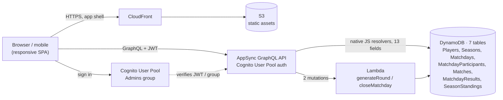
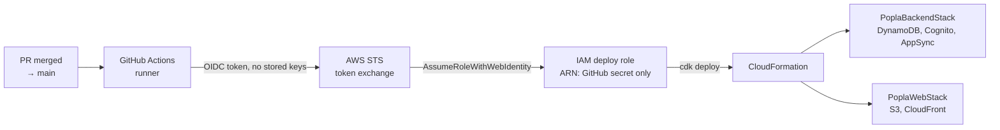

# Popla Cup — Architecture

Companion to `SPEC.md`. Describes the target AWS serverless architecture and
the CDK/CI setup that deploys it.

A more polished, hand-laid-out version of the two diagrams below (same
content) is also published as an artifact for quick reference.

## Diagrams

### Request path

Reads and most writes are resolved **natively** — an AppSync JS resolver
talks straight to DynamoDB, no compute in between. Only the two mutations
with real algorithmic content — `generateRound` (Mexicano/Americano
pairing) and `closeMatchday` (scoring, ranking, season-points transaction)
— take the extra hop through Lambda before reaching the same tables.

### Deploy path

CI proves its identity to AWS with a short-lived OIDC token, never a
stored access key. The one account-specific value in this whole flow —
the deploy role's ARN — exists solely as the `AWS_DEPLOY_ROLE_ARN` GitHub
secret, which is why it never surfaces in source or in this repo's
Actions logs, even though `cdk deploy` itself prints ARNs that contain it.

## Stack Overview

- **Frontend hosting:** S3 (private, Origin Access Control) + CloudFront.
- **API:** AWS AppSync (GraphQL), Cognito User Pool authorizer.
- **Business logic:** AppSync JS (native) resolvers to DynamoDB for CRUD/
  reads and simple writes; Lambda resolvers for the two operations with
  real algorithmic logic (round generation, matchday close).
- **Data:** DynamoDB, one table per entity (not single-table design — this
  app's scale and access patterns don't warrant the added complexity).
- **Auth:** Cognito User Pool, `Admins` group, phase-2 federated social
  login (Google etc.) on the same pool.
- **IaC:** AWS CDK (TypeScript), two stacks (`PoplaBackendStack`,
  `PoplaWebStack`).
- **CI/CD:** GitHub Actions, deploying via `cdk deploy`, authenticated to
  AWS via GitHub OIDC (no long-lived access keys).
- **Domain:** default CloudFront/AppSync endpoints for now; Route53 + ACM
  custom domain to be added later, in front of both the web distribution
  and the API.

## Data Model (DynamoDB)

Plain multi-table design. Each table below is a physical DynamoDB table.

### `Players`
- PK: `playerId`
- Attributes: `displayName`, `email` (optional), `cognitoSub` (nullable,
  set once the player has logged in), `createdAt`.
- Persists across seasons — this is the durable identity a matchday
  participant and season standings entry both point back to.

### `Seasons`
- PK: `seasonId`
- Attributes: `name`, `status` (`ACTIVE` | `CLOSED`), `startDate`,
  `closedAt`.

### `Matchdays`
- PK: `matchdayId`
- Attributes: `seasonId`, `date`, `format` (`MEXICANO` | `AMERICANO`),
  `status` (`SETUP` | `IN_PROGRESS` | `CLOSED`).
- GSI `bySeasonId`: PK `seasonId`, SK `date` — list matchdays in a season,
  chronologically.

### `MatchdayParticipants`
- PK: `matchdayId`, SK: `playerId`
- The registered participant list for a matchday. Count must be a
  multiple of 4.

### `Matches`
- PK: `matchdayId`, SK: `ROUND#<n>#COURT#<c>`
- Attributes: `round`, `court`, `team1PlayerIds` (2), `team2PlayerIds`
  (2), `team1Games`, `team2Games`, `status` (`PENDING` | `COMPLETE`).
- One item per set (4 rounds × N/4 courts per matchday).

### `MatchdayResults`
- PK: `matchdayId`, SK: `playerId`
- Attributes: `setsWon`, `gamesWon`, `gamesLost`, `gameDiff`, `rank`,
  `seasonPoints`, `seasonId` (denormalized for reference).
- Written once, by the `closeMatchday` Lambda, from the completed
  `Matches` for that matchday.
- GSI `byMatchdayRank`: PK `matchdayId`, SK `rankSortKey` — a precomputed,
  zero-padded string encoding `(setsWon desc, gameDiff desc)` so a plain
  descending `Query` returns the day ranking directly. No client-side or
  resolver-side sorting needed.

### `SeasonStandings`
- PK: `seasonId`, SK: `playerId`
- Attributes: `totalPoints`, `matchdaysPlayed`.
- Incrementally updated (atomic `ADD`) by `closeMatchday`, in the same
  transaction as the `MatchdayResults` write.
- GSI `bySeasonPoints`: PK `seasonId`, SK `totalPoints` — descending
  `Query` gives the season leaderboard directly, native resolver, no
  Lambda involved on read.

## Resolver Split

**Native (AppSync JS resolvers, direct to DynamoDB):**
- `getSeason`, `listSeasons`
- `getMatchday`, `listMatchdaysForSeason`
- `listMatches(matchdayId, round?)`
- `getMatchdayRanking(matchdayId)` — Query on `MatchdayResults.byMatchdayRank`
- `getSeasonStanding(seasonId)` — Query on `SeasonStandings.bySeasonPoints`
- `createSeason`, `closeSeason` — simple state changes
- `createMatchday` — includes participant list; JS resolver validates
  participant count is a non-zero multiple of 4 and the season is `ACTIVE`
- `recordSetResult(matchId, team1Games, team2Games)` — JS resolver
  validates the score (`max(team1Games, team2Games) == 6`,
  `min(...) < 6`, i.e. no tiebreak, no win-by-2 requirement) directly in
  the resolver's condition expression before the `UpdateItem`

**Lambda resolvers (real business logic):**
- `generateRound(matchdayId, round)` — reads current standings (round 1:
  the participant list, unranked; round > 1: current `MatchdayResults`
  computed so far — see note below), runs the Mexicano or Americano
  pairing algorithm per `SPEC.md`, batch-writes the `Matches` items for
  that round. Must guard against regenerating an already-played round.
- `closeMatchday(matchdayId)` — aggregates all 4 rounds of completed
  `Matches`, computes each player's setsWon/gamesWon/gamesLost/gameDiff/
  rank/seasonPoints, writes `MatchdayResults`, and atomically increments
  `SeasonStandings` in a single DynamoDB transaction. Also flips
  `Matchdays.status` to `CLOSED`.

Note: Mexicano's round-over-round re-ranking (round 2, 3, 4 pairing
depends on the running standings *within that matchday*, not just the
final `MatchdayResults` which are only written at close) means
`generateRound` computes an in-memory/interim ranking from the completed
`Matches` of prior rounds each time it runs, rather than reading a
persisted "day standings so far" table. This keeps `MatchdayResults` as a
single, unambiguous final-ranking table rather than something written
incrementally.

## Auth

- One Cognito User Pool.
- `Admins` group — phase 1 members created manually (no self-signup).
  Admin mutations (`generateRound`, `recordSetResult`, `closeMatchday`,
  `createMatchday`, `createSeason`, `closeSeason`) are restricted with
  `@aws_auth(cognito_groups: ["Admins"])` in the GraphQL schema — enforced
  by AppSync itself, no application code needed for the check.
- Phase 2: federated identity providers (Google, etc.) added to the same
  User Pool for participant self-signup. New users get no group (i.e.
  read-only participant access to phase-2 features); an admin promotes a
  user into `Admins` when appropriate.
- "Switch role" (admin ⇄ participant) is a **frontend-only** concept —
  since admin permissions are a strict superset of participant
  permissions, there's nothing to change on the backend; the client just
  changes which UI it shows.

## CDK Structure

Two stacks:

- **`PoplaBackendStack`** — Cognito User Pool (+ `Admins` group), the
  DynamoDB tables and GSIs above, the AppSync API (schema, native JS
  resolvers, Lambda resolvers + their Lambda functions and IAM roles).
  Exports the AppSync API URL, API ID, User Pool ID, and User Pool Client
  ID.
- **`PoplaWebStack`** — S3 bucket (private) + CloudFront distribution
  serving the built frontend. Consumes the backend stack's exported
  values as build-time configuration for the frontend bundle.

Splitting this way means a frontend-only change can redeploy
`PoplaWebStack` without touching backend infrastructure, and vice versa.

## CI/CD (GitHub Actions)

- On push to `main`: build the Lambda resolver code and the frontend,
  then `cdk deploy` both stacks in order (`PoplaBackendStack` before
  `PoplaWebStack`, since the web stack needs the backend's outputs).
- AWS authentication via GitHub's OIDC provider assuming a scoped IAM
  role — no long-lived AWS access keys stored as GitHub secrets.

## Open Questions

- Exact streepjes rules — once known, likely an additional attribute on
  `MatchdayResults`/`SeasonStandings` plus a small addition to
  `closeMatchday`'s computation; not expected to change the overall
  architecture.
- Frontend framework/tooling choice — not yet decided.
